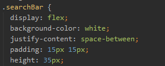
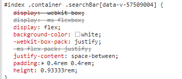

在移动端开发中,不同分辨率的设备所展示的样式也会不同.为了解决这一问题,我们用rem单位替换掉原来的px单位.
已达到移动端自适应的效果

## rem

先来简单了解一下rem.

`rem`（font size of the root element）是指相对于`根元素`的字体大小的单位。简单的说它就是一个相对单位。看到rem大家一定会想起em单位，em（font size of the element）是指相对于`父元素`的字体大小的单位。它们之间其实很相似，只不过一个计算的规则是依赖`根元素`一个是依赖`父元素`计算。

```css
html{
    font-size:20px;
}
.btn {
    width: 6rem;
    height: 3rem;
    line-height: 3rem;
    font-size: 1.2rem; 
}
```
如上述代码, `html`中设置了`font-size`为20px. 那么根据`rem`计算规则, `.btn`中的`width:6rem` 其实等价于`width:120px`;
也就是说现在的`1rem = 20px`. 那么之后我们在开发过程中只需使用rem作为基本单位即可.

这里就会有个问题.我要如何知道根节点中`font-size`应该设置多少呢?

## 设置根节点font-size

```js
//设置根节点font-size
  (function (doc, win) {
    var docEl = doc.documentElement,
      resizeEvt = 'orientationchange' in window ? 'orientationchange' : 'resize',
      recalc = function () {       
        var rem = docEl.clientWidth / 10;
        if (!rem) return;
              docEl.style.fontSize = rem + 'px';
      };
    recalc();
    if (!doc.addEventListener) return;
    win.addEventListener(resizeEvt, recalc, false); //窗体大小发生改变时
    doc.addEventListener('DOMContentLoaded', recalc, false);//文档重载时
  })(document, window);
```
只需通过上面的代码.我们既可给html设置对应的`font-size`值.

## 自动转换px为rem postcss-pxtorem

现在根节点的值设置好了,我们只需在开发过程中使用rem单位就可以实现自适应了,但是我们常用的是px单位.ui给出的设计稿也是px作为单位.
所以,我们需要一个将px转换为rem单位的东西`postcss-pxtorem`  [github地址](https://github.com/cuth/postcss-pxtorem)

这是一个`css后置处理器`,通过配置.可以将所有的px单位转换成rem. 以便于我们还是按照UI给的设计稿中的px单位进行开发,不用去考虑rem
的转换

### Install
首先安装 postcss-pxtorem
```bash
npm install postcss-pxtorem --save-dev
```
### vue-cli 配置
根目录下 配置`.postcssrc.js`文件

```js
module.exports = {
  "plugins": {   
    "postcss-pxtorem": {
      "rootValue": 37.5,
      "propList": ["*"],
      // 注意：如果有使用第三方UI如VUX，则需要配置下忽略选择器不转换。
      // 规则是class中包含的字符串，如vux中所有的class前缀都是weui-。也可以是正则。
      "selectorBlackList": ["vux-", 'van-']
    }
  }
}
```

配置完成后在css编写过程中,依旧使用`px`作为单位.`pxtorem`会自动帮我们转换.
如下图

 
 
 
 

