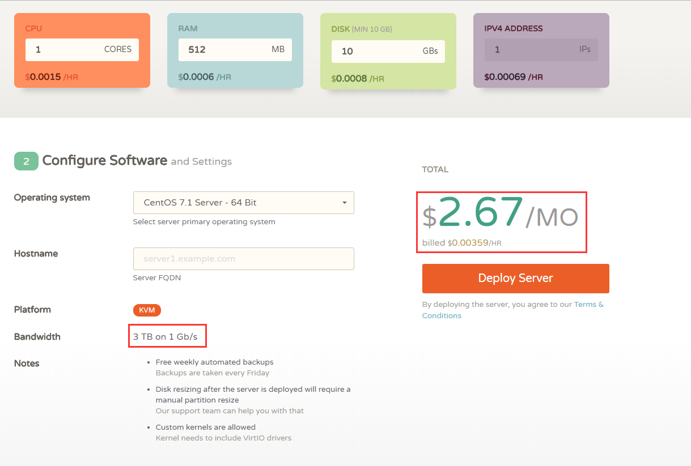
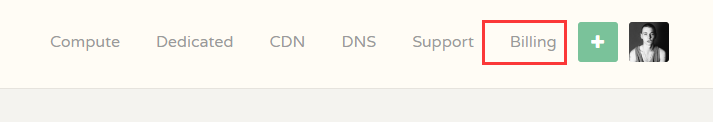
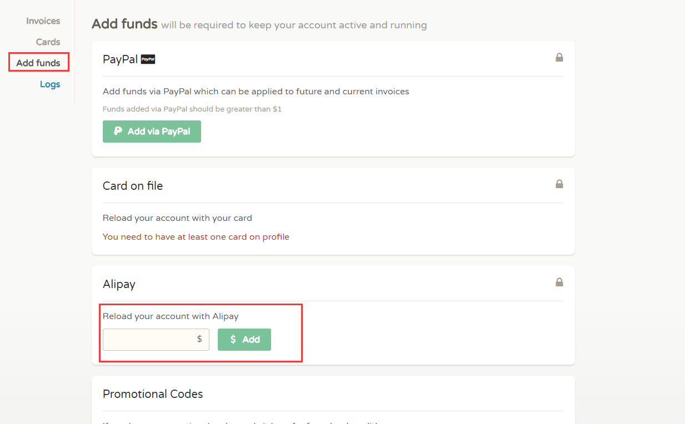

现目前网上有很多vpn，但是基本上都是收费的软件，即使有免费的网速也不怎么好，而且不稳定。
再者收费软件价格也不低，对于个人使用来说成本还是比较高的。
作为开发人员呢，基本上都会有自己的一个vps，那么就可以利用这vps（国外且未被墙）来搭建属于自己的vpn.
一来不仅可以有自己的服务器放点项目，也可以作为vpn服务器。也是比较好的选择。

## vps选择
国外的服务器较多，常见的有搬瓦工，vultr，linode。但看了测评，貌似都不怎么样，价格也一般。
所以，这里我推荐  [cloudcone](https://app.cloudcone.com/?ref=1080)，最低1.99$，基本配置也就2.67$1核0.5g内存,10g磁盘还是足够了.
`*cloudcone支持支付宝付款,每次最低充值5$,充值入口如下:`

`本例选用Centos6.5`
::: tip 
购买成功后,服务器信息会发送到你注册时填的邮箱中.包括服务器ip,用户名,密码
:::
##  搭建ss
###  安装python-pip
电脑下载一个`xShell`,在邮件中找到服务信息,连接上服务器
````
yum -y install python-pip
`````
`*如果提示No package python-pip available.Error: Nothing to do因为没有此rpm包，此包包含在pel源里面,执行如下代码:`

````
 rpm -ivh http://dl.fedoraproject.org/pub/epel/6/i386/epel-release-6-8.noarch.rpm
````
安装成功后会提示Complete! 之后清除一下缓存
````
yum clean all 
````
###  安装shdowsocks
 ````
  pip install shadowsocks
 ````
 OK,目前位置ss就安装好了,接下来开始配置服务
##  配置ss服务
###  新建配置文件
````
vim /etc/shadowsocks.json
`````
没有安装vim的可以使用vi`然后输入一下配置信息
````json
{
  "server": "ip",
  "port_password": {
    "port": "pwd"
  },
  "local_address": "127.0.0.1",
  "local_port": 1080,
  "timeout": 300,
  "method": "aes-256-cfb"
}
````
编辑好后`esc`退出输入`:wq`保存
###  启动/停止ss服务前台运行:
````
ssserver -c /etc/shadowsocks.json        
````
关闭窗口后即退出ss服务`后台运行:
````
ssserver -c /etc/shadowsocks.json -d start
````
后台停止:
````
ssserver -c /etc/shadowsocks.json -d stop
````

OK,至此shdowsocks服务端安装完毕.