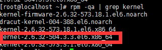

搭建好ssr后,基本的日常fq需求还是能满足了,但是要上油管什么的看高清视频还是有点压力的.
这篇文章将为之前搭好的ssr安装`锐速`

**1 下载更换内核**

 首先说明,OpenVZ是无法更换内核的.这里我们使用的是kvm.centos6.5
 
 `centos6.x`内核更换为: `2.6.32-504.3.3.el6.x86_64`
 
 ````shell
 rpm -ivh http://soft.91yun.org/ISO/Linux/CentOS/kernel/kernel-firmware-2.6.32-504.3.3.el6.noarch.rpm
 rpm -ivh http://soft.91yun.org/ISO/Linux/CentOS/kernel/kernel-2.6.32-504.3.3.el6.x86_64.rpm --force
 ````
 
 `centos7.x`内核更换为: `3.10.0-229.1.2.el7.x86_64`
 ```shell
 rpm -ivh http://soft.91yun.org/ISO/Linux/CentOS/kernel/kernel-3.10.0-229.1.2.el7.x86_64.rpm --force
 ```
 ::: tip
 注意 绝大多数情况下是无法直接下载更换的.这里需要将centos更新
 ````shell
 yum update -y
 ````
 这个过程有点漫长.根据自身网络环境和vps.一般在15分钟左右.快点的话10来分钟
 ::: 
 
**2 查看内核是否安装成功** 

 ````shell
 rpm -qa | grep kernel
 ````
 
 
 若看到`kernel-2.6.32-504.3.3.el6.x86_64`则说明安装成功
 
**3 重启查看是否更换成功**
 
 ````shell
 reboot
 ````
 ````shell
 uname -r
 ````
 
**4 安装锐速**
 ````shell
 wget -N --no-check-certificate https://github.com/91yun/serverspeeder/raw/master/serverspeeder.sh && bash serverspeeder.sh
 ````
 ::: tip
 锐速的几个相关命令 
 
 service serverSpeeder status 查看serverSpeeder的状态 
 
 service serverSpeeder start | stop | restart 停止暂停重启锐速  
 :::

尽管有不少人觉得安装锐速后没什么效果,但就目前个人的几个vps在安装锐速后速度都得到了明显的提升
 特别是YouTube.没装锐速前看1080就差不多了.装了之后看4k基本没问题.
 当然,这只是个人得到的结果.至于大家是什么样的还得看情况