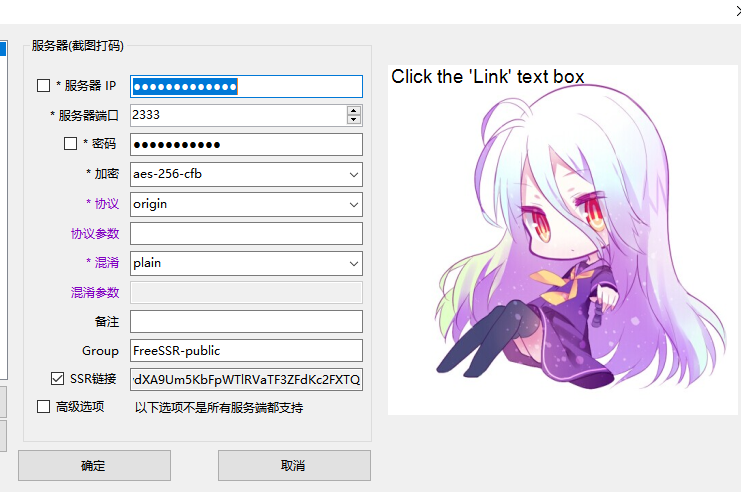
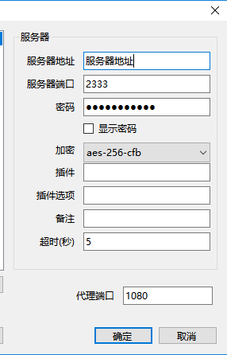
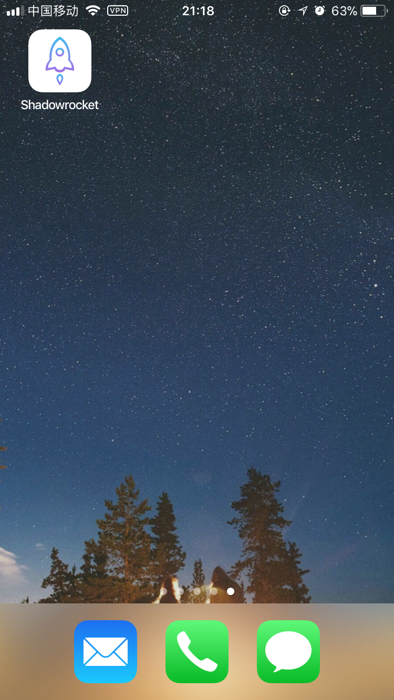
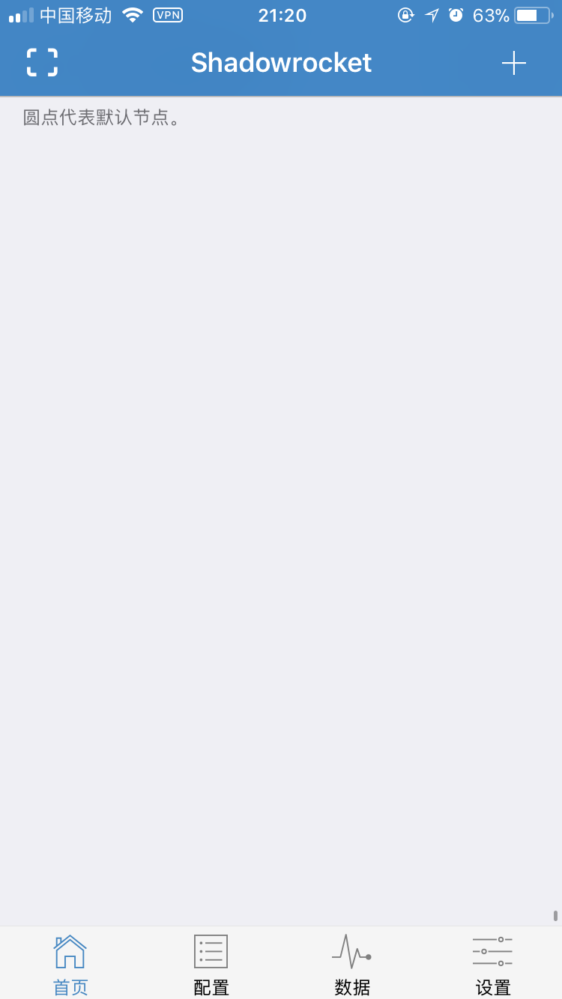
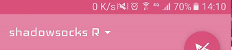
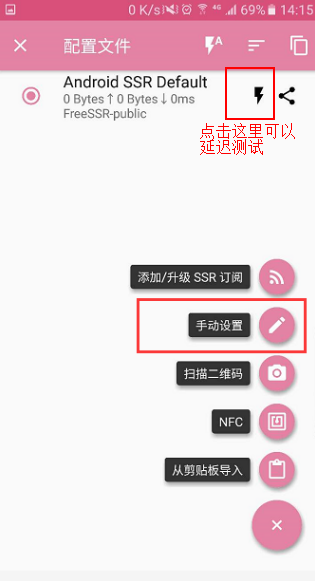
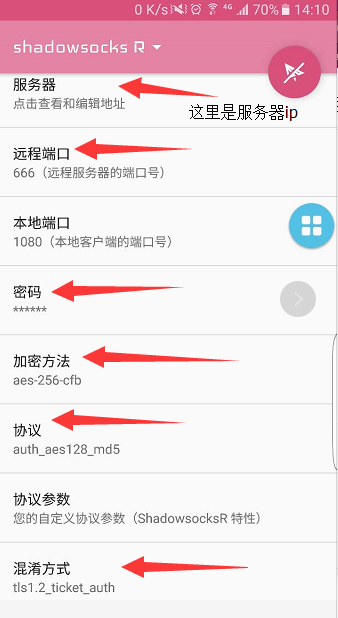

接上一篇文章,配置完服务端shdowsocks后要怎么在客户端使用呢.下面就是客户端(Windows,Ios,android)下的不同配置及软件下载
## Windows端
 首先下载ssr客户端,github下载地址:[shadowsocksr](https://github.com/shadowsocksrr/shadowsocksr-csharp/releases)[shdowsocks](https://github.com/shadowsocks/shadowsocks-windows/releases)
 `下载解压后运行.exe执行文件,右键点击右下角小飞机图标进行配置`

### shadowsocksr

 配置如下:输入之前在服务器配置的ip地址端口号,密码及加密方式`*shadowsocksr 协议默认选择origin,混淆选择plain
 `点击确定后即可`
 *鼠标点击SSR链接可生成二维码,二维码可以在pc端手机端通过扫码自动添加配置

### shdowsocks 配置:

 

 shdowsocks配置比较简单,只需要输入ip,端口,密码,加密方式即可.最后别忘了点击启动系统配置

## Ios

 由于国内App Store里shdowsocks相关软件被禁,所以需要借助三方工具`pp助手`手机连接电脑,安装`pp助手`后搜索`Shadowrocket`
 `*注:是Shadowrocket 不是shdowsocks shadowsocksr`
  

  
  
  

 安装完成后点击`+`添加配置.配置与pc端无异或通过扫描pc端生成的二维码自动添加配置

## Android

  

  点击`shadowsocks R`

  

  
  
  

 [Android-7.0-SSR.apk](https://blog.moog.site/soft/Android-7.0-SSR.apk)
 
 [Android-shadowsocksr下载地址1(zip)](https://www.i5seo.com/1/SSR_3.4_for_android.zip)

 [Android-shadowsocksr下载地址2(安卓7.0版)(zip)](http://www.i5seo.com/1/Android-7.0-SSR.zip)

 下载安装后依旧可以选择手动添加和扫码添加.
 推荐扫码添加OK,到此pc和移动端就可以开开心心的使用自己的vpn了.